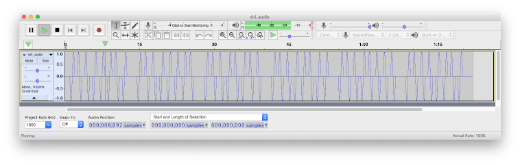

2013-forensic-300
=================

Link: https://backdoor.sdslabs.co/challenges/2013-FORENSIC-300 \
Tags: [forensics]

Description:
------------

Extract a flag from an audio file.

Solution:
---------

When unzipped, the audio file turns out to be an 8 bit WAV file with a very low sampling frequency of just 1000 Hz. It's also very quiet. If you open it in [Audacity](https://www.audacityteam.org) and look at the waveform you can see why:

Those sinusoidal pulses have a frequency of 1 Hz, which is far too low to be audible. But look closer. Those pulses are arranged in groups of eight, and have a mixture of polarities — some go down, up, and then down again, while others go up, down, and then up again. If those two different polarities corresponded to ones and zeros, then the whole audio file represents six bytes of data. If you can find out what those bytes are, then you should have no trouble getting the flag.
